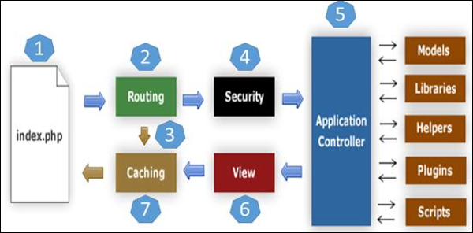

# Codeigniter Notes

## Theory
- Small footprint, fast, no basic config
- Architecture:
    
    

## CI controller
- intermediary between the model and the view.
- CI_Controller class must be extended Whenever u want to create Your own Controller.
- Controller name must be Started with Capital letter
- Controller name and file name must be Similar
- Call the method: http://localhost/index.php/controller-name/method-name (with no .php extention)

- loading view on a controller:
```php
    $this->load->view('directory_name/view_page_name');
```

## CI Models
- Models are the classes designed to work with information in the database.
- Class name and Page name must be similar.
- Every Model class called/used inside a Controller.
```php
    // 1. Load a Model
    $this->load->model('model_name');

    // 2. Use a Model
    $this->model_name->method_name();
```

## CI Database Configuration

1. 1.Automatic Connecting:
    - Automatic Connection can be done using application/config/autoload.php
        $autoload['libraries'] = array('database');

2. Manual Connecting
    - in manual Connection u will have to Create connection for every Controller So it would be better to use Automatic Connection.
        $this->load->database();
    
## CI URL Routing
Above URL will work on the following methods called inside the controller:
    /blog 		= index method
    /blog/create 	= create method
    /blog/update	= update method
    /blog/delete 	= delete method
Before creating a controller and view for the above structure to work. Custom Url must be setup by creating routes for the project. Open application/config/route.php Add specific lines omitting the default one.

    $route['default_controller'] 		= 'welcome';
    $route['blog'] 				= 'blog';
    $route['blog/create']			= 'blog/create';
    $route['blog/update/:id']		= 'blog/update';
    $route['blog/delete/:id']		= 'blog/delete';

### Boilerplate for CI routes (remove .php)

- Remove ControllerName.php from URL to each request.
    * Goto application/config/config.php
    - Set Base URL here
    - Set $config['index_page'] = 'index.php'; to $config['index_page'] = '';
    - Create .htaccess file in root and place following content, a boilerplate for all CI applications
        ```php
            RewriteEngine on
            RewriteCond $1 !^(index\.php|assets|images|js|css|uploads|favicon.png)
            RewriteCond %(REQUEST_FILENAME) !-f
            RewriteCond %(REQUEST_FILENAME) !-d
            RewriteRule ^(.*)$ ./index.php/$1 [L]
        ```
    - Now you can access controller method via URL_root/ControllerName/method_name

### Define Routes
- Goto application/config/routes.php
```php
    // It will translate it into
    // ROOT_URL/any_url => ROOT/pages/view/any_url   
    $route['(:any)'] = 'pages/view/$1';
    
    // For default homepage
    $route['default_controller'] = 'pages/view';
```

## CI Views
- The view(designing page) can't access directly it always called by Controller.
```php
    // Load a view
    $this->load->view('view/home');

    // Send data to a view page
    $data['title'] = 'Any Data here';
    $this->load->view('view/about', $data);

    // To show data in view
    <?= $title ?>

```

## CI Helpers, Packages, Libraries, Custom Files, Models etc.
- Goto application/config/autoload
- Load files here globally
```php
    // Add url, file etc helpers in the array
    $autoload['helper'] = array(); => $autoload['helper'] = array('url');

    // Now use those helper functions anywhere
    <?php echo base_url(); ?>
```

## CI forms
- Include 'form' helper in autoload.php
- For form validation add library 'form_validation' in autoload.php > libraries
```php
    // Create form like;
    <?php echo form_open('/posts/edit/'.$id); ?>
    // OR
    <?php echo form_open_multipart('/posts/edit/'.$id); ?>
    </form>

    // Show validation errors
    // Show all errors
    <?php echo validation_errors(); ?>
    // Shoow error by a field
    <?php echo form_error('name'); ?>

    // Apply validation rules in controller
    // Form validation rules
    $this->form_validation->set_rules('title', 'Title', 'required');
    $this->form_validation->set_rules('body', 'Body', 'required');
    if($this->form_validation->run() === FALSE){ // If form not submitted
        $this->load->view('homepage');
    }else{ // when form submitted
        // Validation passed
        $this->post_model->create_post();
        redirect('posts');
    }

    // Upload image
    $config['upload_path'] = './assets/images/posts';
    $config['allowed_types'] = 'gif|png|jpg|jpeg';
    $config['max_size'] = '2048';   // 2MB
    $config['min_width'] = '500';
    $config['max_width'] = '500';
    $this->load->library('upload', $config);
    if(!$this->upload->do_upload()){
        $errors = array('error' => $this->upload->display_errors());
        $post_image = $_FILES['userfile']['name'];
    }
    $this->post_model->create_post($post_image);
    redirect('/');

    // To show the image after getting pic name from the db
    assets/images/posts/<?php echo $post['post_image']; ?>">


```

## CI Database configurations
- Goto application/config/database
- Set the variables accordingly
```php
    // Connect with the DB
    $this->load->database();

```

## CI Model
- All CI models placed under application/models/
```php
    // Create a new files Posts_model.php
    <?php
    class Post_model extends CI_Model{
        public function __construct(){
            // Load database library
            $this->load->database();
        }
        public function get_posts($slug=FALSE){
            $query = $this->db->get('posts');
            return $query->result_array();
        }
    }

    // Load model globally and use in any controller
    // Go to application/config/autoload
    $autoload['model'] = array('post_model');

    // Use this model in a controller 
    $data['posts'] = $this->post_model->get_posts();

    // For Model CRUD functionality goto
    // Models/Posts.php


    // Get relationship data
    $this->db->order_by('posts.id', 'DESC');
    $this->db->join('categories', 'categories.id = posts.category_id');
    $query = $this->db->get('posts');
    return $query->row_array();
```

## CI Assets
- Create a new folder 'assets' in root dir
- place css/js etc in folders.
```php
    // To load asssets in a html file
    <link rel="stylesheet" href="<?php echo base_url(); ?>assets/css/style.css">
```

## CI Login / Registration System

1. Create Users table
```sql
    CEATE TABLE `ci_db`.`Users` ( `id` INT NOT NULL AUTO_INCREMENT , `name` VARCHAR(255) NOT NULL , `email` VARCHAR(255) NOT NULL , `password` VARCHAR(255) NOT NULL , `register_date` TIMESTAMP NOT NULL DEFAULT CURRENT_TIMESTAMP , `username` VARCHAR(255) NOT NULL , PRIMARY KEY (`id`)) ENGINE = InnoDB;
```

* Please go through following folder/files.
    - models/user_model.php, controllers/Users, views/users

2. Create Users Controller
```php
    class Users extends CI_Controller
    {
        // Register user
        public function register()
        {
            $data['title'] = 'Sign Up';
            $this->form_validation->set_rules('name', 'Name', 'required');
            $this->form_validation->set_rules('username', 'Username', 'required|callback_check_username_exists');
            $this->form_validation->set_rules('email', 'Email', 'required|callback_check_email_exists');
            $this->form_validation->set_rules('password', 'Password', 'required');
            $this->form_validation->set_rules('password2', 'Confirm Password', 'matches[password]');

            if($this->form_validation->run() === FALSE)
            {
                $this->load->view('templates/header');
                $this->load->view('users/register', $data);
                $this->load->view('templates/footer');
            }
            else
            {
                // Encrypt Password
                $enc_password = md5( $this->input->post('password') );
                $this->user_model->register($enc_password);

                // Set message
                $this->session->set_flashdata('user_registered', 'You are now registered and can log in');
                redirect('posts');
            }
        }

        // Login user
        public function login()
        {
            $data['title'] = 'Sign In';
            $this->form_validation->set_rules('username', 'Username', 'required');
            $this->form_validation->set_rules('password', 'Password', 'required');

            if($this->form_validation->run() === FALSE)
            {
                $this->load->view('templates/header');
                $this->load->view('users/login', $data);
                $this->load->view('templates/footer');
            }
            else
            {
                // Login a user
                $username = $this->input->post('username');
                $password = md5($this->input->post('password'));

                $user_id = $this->user_model->login($username, $password);
                if($user_id)
                {
                    // Success login > Set Session
                    $user_data = array(
                        'user_id' => $user_id,
                        'username' => $username,
                        'logged_in' => true,
                    );
                    $this->session->set_userdata($user_data);

                    $this->session->set_flashdata('login_success', 'You are now logged in.');
                    redirect('posts');
                }
                else
                {
                    // Login failed
                    $this->session->set_flashdata('login_failed', 'Login is invalid.');
                    redirect('users/login');
                }
            }
        }
        // Log user out
        public function logout()
        {
            // Unset userdata
            $this->session->unset_userdata('logged_in');
            $this->session->unset_userdata('user_id');
            $this->session->unset_userdata('username');

            // Set message
            $this->session->set_flashdata('logout_success', 'You are successfully logged out.');
            redirect('users/login');
        }

        // Check if username exists
        public function check_username_exists($username)
        {
            $this->form_validation->set_message('check_username_exists', 'That username is taken. Please choose a different one.');
            if($this->user_model->check_username_exists($username))
            {
                return true;
            }else{
                return false;
            }
        }
        // Check if email exists
        public function check_email_exists($email)
        {
            $this->form_validation->set_message('check_email_exists', 'That email is taken. Please choose a different one.');
            if($this->user_model->check_email_exists($email))
            {
                return true;
            }else{
                return false;
            }
        }
    }
```

3. Create a User_mnodel
```php
    class User_model extends CI_Model
    {
        public function __construct()
        {
            
        }
        public function register($enc_password)
        {
            // User data array
            $data = array(
                'name' => $this->input->post('name'),
                'username' => $this->input->post('username'),
                'email' => $this->input->post('email'),
                'password' => $enc_password,
            );

            // Insert user
            return $this->db->insert('users', $data);
        }

        // Login user
        public function login($username, $password)
        {
            // Validate
            $this->db->where('username', $username);
            $this->db->where('password', $password);
            $result = $this->db->get('users');
            if($result->num_rows()==1)
            {
                return $result->row(0)->id;
            }
            else
            {
                return false;
            }
        }

        // Check username exists
        public function check_username_exists($username)
        {
            $query = $this->db->get_where('users', array('username'=>$username) );
            if(empty( $query->row_array() ))
            {
                return true;
            }
            else
            {
                return false;
            }
        }
        // Check email exists
        public function check_email_exists($email)
        {
            $query = $this->db->get_where('users', array('email'=>$email) );
            if(empty( $query->row_array() ))
            {
                return true;
            }
            else
            {
                return false;
            }
        }
    }
```

4. Check logged in user
```php
    // Only logged in users can access this controller
    if(!$this->session->userdata('logged_in'))
    {
        redirect('users/login');
    }
```
## CodeIgniter Multiple Authentication Setup

### 1. Database Setup:
- users_table: (id, username, email, password, level) 
// Above level 1=admin; 2=user; 3=employee; etc.

### 2. Login Module:
controller/Login.php, login_view.php, Model/Login_model

```php

- controller/Login.php
class Login extends CI_Controller
{
	public function __construct()
	{
		parent::__construct();
	}
	public function index()
	{
		$this->load->view('login_view');
	}
	function auth()
	{
		$username = $this->input->post('username', TRUE);
		$password = $this->input->post('password', TRUE);
		$result = $this->Login_model->check_user($username, $password);

		if($result->num_rows() > 0)
		{
			$data = $result->row_array();
			$name = $data['username'];
			$email = $data['email'];
			$level = $data['level'];

			// Set Session
			$ses_data = array(
				'username' => $username,
				'email' => $email,
				'level' => $level,
				'logged_in' => TRUE
			);
			$this->session->set_userdata($ses_data);

			// Redirect users to its destination according to its role
			if($level === '1')
			{
				redirect('Admin');	// To Admin Controller's index

			}
			else if($level === '2')
			{
				redirect('User');
			}
			else if($level === '3')
			{
				redirect('Employee');
			}
			else
			{
				echo '<script> alert('Access denied!!'); history.go(-1); </script>'
			}

			$this->load->view('login_view');
		}
	}
	function logout()
	{
		$this->session->sess_destroy();
		redirect('Login');

		// For logout redirect
		// echo site_url('Login/logout');
	}
}

-views/login_view.php

<html>
	<h1>Login Form</h1>
	<form action="<?php echo site_url('Login/auth'); ?> method="POST">
		inputs: username, password
	</form>
</html>


-models/Login_model.php

class Login extends CI_Model
{
	public function check_user($username, $password)
	{
		$this->db->select('*');
		$this->db->select('users_table');
		$this->db->where('username', $username);
		$this->db->where('password', md5($password) );
		$query = $this->db->get();
		return $query;
	}
}
```

### 3. Create views (dashboards) for all roles
- views / Admin.php, User.php, Employee.php

### 4. Create controllers for all roles
- controllers / Admin.php, User.php, Employee.php

```php
- controllers/Admin.php
class Admin extends CI_Controller
{
	public function __construct()
	{
		parent::__construct();
		// Only allow admins here
		if($this->session->userdata('logged_in') !== TRUE)
		{
			redirect('Login');	// Show login view
		}
	}
	public function index()
	{
		if($this->session->userdata('level') === '1')
		{
			$this->load->view('admin_view');
		}
		else
		{
			echo "Access Denied";
		}
	}
}
```
			

